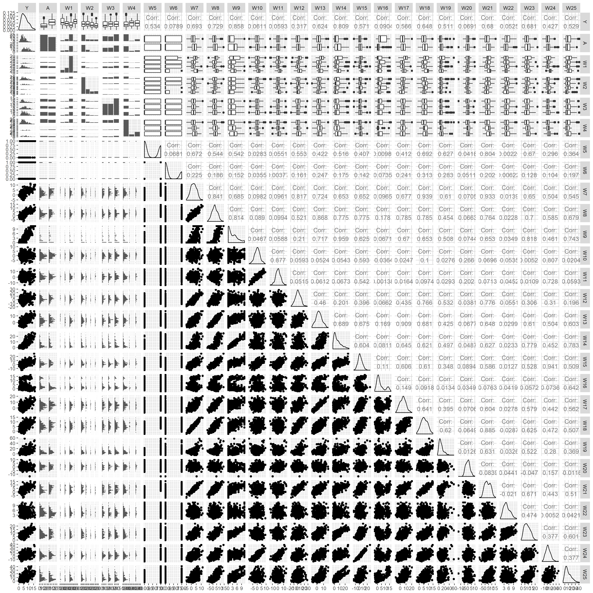

## Purpose
Document for data exploration for __Data Challenge 2017__!

```{r setup, include=FALSE}
knitr::opts_chunk$set(echo = TRUE)

#read in neccessary packages

ipak <- function(pkg){
    new.pkg <- pkg[!(pkg %in% installed.packages()[, "Package"])]
    if (length(new.pkg)) 
        install.packages(new.pkg, dependencies = TRUE)
    sapply(pkg, require, character.only = TRUE)
}

packages <- c("GGally", "tidyverse", "caret", "glmnet", "arsenal", "rpart",
              "rpart.plot")

ipak(packages)

#read in dataset
  # variable x1 operates the same as ID. Will keep ID.
dc1 <- read_csv("Data.csv")[-1]

##EVALUATE THE STRUCTURE OF THE DATA

dim(dc1)
names(dc1)
str(dc1)

```

# Look at the data

```{r tab1, include = TRUE, echo=FALSE, results='asis'}

## CREATE A SUMMARY TABLE
#change the treatment from integer to character so the desired information is expressed in the summary table

class(dc1$A) <- "character"
class(dc1$W5) <- "character"
class(dc1$W6) <- "character"

tab1 <- dc1 %>% 
  dplyr::select(-ID) %>% 
  tableby(formula = ~ .)

summary(tab1, title = "Overall Data Summary")

tab2 <- dc1 %>% 
  tableby(formula = formulize("A", names(dc1)[4:28]))

summary(tab2, title = "Overall Data Summary: By A", pfootnote=TRUE)
```


```{r spm1, include = TRUE, fig.align="center", cache=TRUE, echo=FALSE}

## CREATE A SCATTERPLOT MATRIX

# ID has no bearing on the modeling. will exclude from evaluation.

sp1 <- dc1 %>% 
  dplyr::select(-ID) %>% 
  ggpairs()

# sp1
# ggsave("sp1.png", device = "png", plot = last_plot(), width = 15, height = 15, unit = "in")
# unlink("sp1.png") do not run this

# Y is skewed right and strictly positive. will try log transform to see what it looks like.

sp2 <- dc1 %>% 
  mutate(log_y = log(Y)) %>% 
  dplyr::select(-ID, -Y) %>%
  dplyr::select(log_y,everything()) %>% 
  ggpairs()

# sp2
# ggsave("sp2.png", device = "png", plot = last_plot(), width = 15, height = 15, unit = "in")

sp3 <- dc1 %>% 
  dplyr::select(-ID, -Y) %>% 
  ggpairs()

# sp3
# ggsave("sp3.png", device = "png", plot = last_plot(), width = 15, height = 15, unit = "in")
```
Scatterplot Matrix without Transformation


Scatterplot Matrix with log transform on response variable. 


```{r, model1, include=TRUE, echo=FALSE, results='asis'}

mod1 <- modelsum(data = dc1, formula = formulize("Y", names(dc1)[4:28]), adjust = ~ A, family = "gaussian")
summary(mod1, title = "Model Summaries: Y = W_i + A, for i = 1, 2, ..., 25")
```

# Playtime!
## Different Methods of Variable Selection:
### Decision Trees, Lasso, Forward, Stepwise, Manual (not backward)

```{r treeeeeeeees, include = TRUE, echo = FALSE}
########################## TREEEEEEEEEEEEEEEEES ##########################
#http://www.milbo.org/doc/prp.pdf

tree1 <- rpart(formula = formulize("Y", c(names(dc1)[4:28], "A")), method="anova", data = dc1)

#tiff(filename="", width = 900, 
#	height = 900, units = "px", pointsize = 12)

rpart.plot(tree1, main = "Sweet, Sweet Plot",
	type=4, extra= 101, under=TRUE, snip=FALSE, box.palette="BuGy", fallen = T,
	prefix = paste("Predicted\n","Y", "= ", sep=" "), branch.lty=3, nn=TRUE)

#dev.off()

# Binary Decision Tree
# First look at "Variable Importance"

tree2 <- rpart(data = dc1, formula = formulize("Y", c(names(dc1)[4:28], "A")))

summary(tree2) #Look at variable importance for funs
plot(tree2)
text(tree2)
title("I'm Bored")
```

From the scatterplot matrix there appears to be several variables that are very strongly correlated.
Techniques to consider: lasso, pls, others?

Of the variables that are highly correlated, can select the variable(s) that appear to be most correlated with the response

Must not lose focus. The objective is to measure the treatment effect of A, not predict Y.

```{r blasso, include = FALSE, echo = FALSE, cache = TRUE}
#requires that trainX is a data.frame, trainY is numeric, character variables be provided as dummy variables, and numeric variables be centered and scaled

#Bayesian Lasso

dc1 <- dc1 %>% 
  dplyr::select(-ID) %>% 
  as.data.frame()

dummies <- dummyVars(Y ~., data = dc1)
dummies2 <- as.data.frame(predict(dummies, newdata = dc1))

dc2 <- as.data.frame(cbind(dc1$Y, dummies2))
names(dc2)[1] <- "Y"

set.seed(1)

inTrain <- createDataPartition(dc2$Y, p = .75, list = FALSE)

training<-dc2[inTrain,]
testing<-dc2[-inTrain,]
dim(training)

trainY <- training$Y

trainX <- training %>% 
  dplyr::select(-Y)

testY <- testing %>% 
  dplyr::select(Y)

testX <- testing %>% 
  dplyr::select(-Y)

# https://topepo.github.io/caret/model-training-and-tuning.html
#rctrl1 <- trainControl(## 10-fold CV
#                           method = "repeatedcv",
#                           number = 10,
#                           ## repeated ten times
#                           repeats = 10)
#rctrl2 <- trainControl(method = "LOOCV")
#rctrl3 <- trainControl(method = "none")
#rctrlR <- trainControl(method = "cv", number = 3, #returnResamp = "all", search = "random")

#set.seed(8675309)

#test_rep_cv_model <- train(trainX, trainY, method #= "blasso",     trControl = rctrl1, 
#   #preProc = c("center", "scale"), 
#    verb = 0)

#test_reg_pred <- predict(test_rep_cv_model, testX)

#blassoGrid <- expand.grid(sparsity = seq(0.1, 0.5, #0.1))

#test_rep_cv_model2 <- train(trainX, trainY, method #= "blasso",     trControl = rctrl1, 
#   #preProc = c("center", "scale"), 
#    verb = 0,
#   tuneGrid = blassoGrid)

#test_reg_pred2 <- predict(test_rep_cv_model2, #testX)

###############################################

#Bayesian Lasso

reg.blasso = blasso(trainX, trainY)

## summarize the beta (regression coefficients) estimates
plot(reg.blasso, burnin=200)

## plot the size of different models visited
plot(reg.blasso, burnin=200, which="m")

## get the summary
s <- summary(reg.blasso, burnin=200)

## calculate the probability that each beta coef != zero
s$bn0

## summarize s2
plot(reg.blasso, burnin=200, which="s2")
s$s2

## summarize lambda2
plot(reg.blasso, burnin=200, which="lambda2")
s$lambda2

###############################################

# Lasso


```